# Top 25 Best Outdoor Gear Retailers in 2025

Shopping for outdoor equipment online means navigating dozens of retailers claiming the best prices, widest selection, and fastest shipping. The right outdoor gear website balances authentic product offerings from trusted brands with knowledgeable customer service and return policies that accommodate the unpredictability of backcountry adventures. This comprehensive overview covers 25 outdoor gear retailers ranked by inventory depth, brand authenticity, and customer satisfaction, helping you find camping equipment, climbing gear, ski setups, and trail-running shoes without risking counterfeit products or disappearing storefronts.

---

## **[Backcountry](https://www.backcountry.com)**

Industry-leading online specialty retailer connecting outdoor enthusiasts with premium gear for skiing, climbing, hiking, camping, and cycling adventures since 1996.

Founded in Park City, Utah by Jim Holland and John Bresee selling avalanche gear from their garage, Backcountry has evolved into one of America's most trusted outdoor retailers. The platform carries equipment spanning winter sports, rock climbing, mountain biking, trail running, fly fishing, kayaking, and more across men's, women's, and kids' categories. Expert Gearheads provide personalized product recommendations through phone, chat, and email consultations, helping customers select appropriate equipment for specific adventures and conditions. The 90-day return policy accommodates gear testing on actual trips, recognizing that fit and performance often can't be assessed in living rooms. Free shipping kicks in at reasonable thresholds making multi-item orders practical. Physical retail stores in Salt Lake City, Bozeman, Boulder, Seattle, and Chicago combine online convenience with in-person expertise. The 2013 acquisition of German retailer Bergfreunde.de expanded European operations. Ownership transferred from Liberty Media to TSG Consumer Partners in 2015, then to CSC Generation in 2024, maintaining operational continuity throughout transitions. Steep & Cheap operates as the discount outlet offering daily deals on premium brands at reduced prices.

***

## **[REI](https://www.rei.com)**

Member-owned cooperative since 1938 offering 180+ retail locations nationwide alongside comprehensive e-commerce platform with industry-leading return policies.

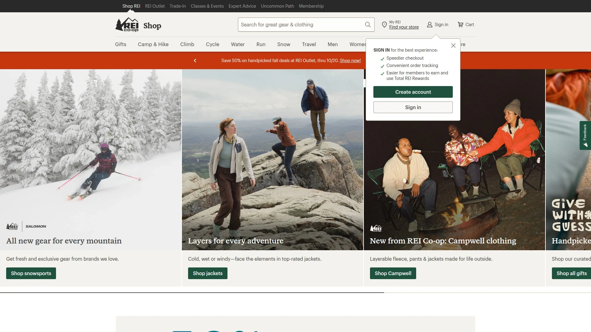

REI Co-op stands as the dominant force in American outdoor retail through its unique cooperative structure where customers become lifetime members for $30, earning annual dividends averaging 10% on full-priced purchases. The dividend program rewards loyalty while funding conservation initiatives and outdoor access projects. Physical stores provide hands-on gear testing, expert staff consultations, and community-building through REI Adventures vacation programs and Outdoor School classes teaching wilderness skills. The online platform carries camping gear, climbing equipment, hiking boots, mountain bikes, kayaks, and apparel from major brands plus the expanding REI Co-op house line delivering quality at accessible price points. REI Outlet offers discontinued models and overstocked items at significant discounts, while REI Used enables members to buy and sell pre-owned gear reducing waste. The generous return policy allows members to return purchases within one year if dissatisfied, building confidence in gear investments. Free shipping on orders exceeding $50 makes online shopping practical. The Seattle flagship store near Interstate 5 operates as a tourist destination featuring climbing walls and gear museums. Over 140 locations across 42 states bring REI's expertise to local communities.

***

## **[Patagonia](https://www.patagonia.com)**

Environmental activist outdoor brand manufacturing technical apparel and equipment while pioneering sustainability initiatives throughout the industry since 1973.

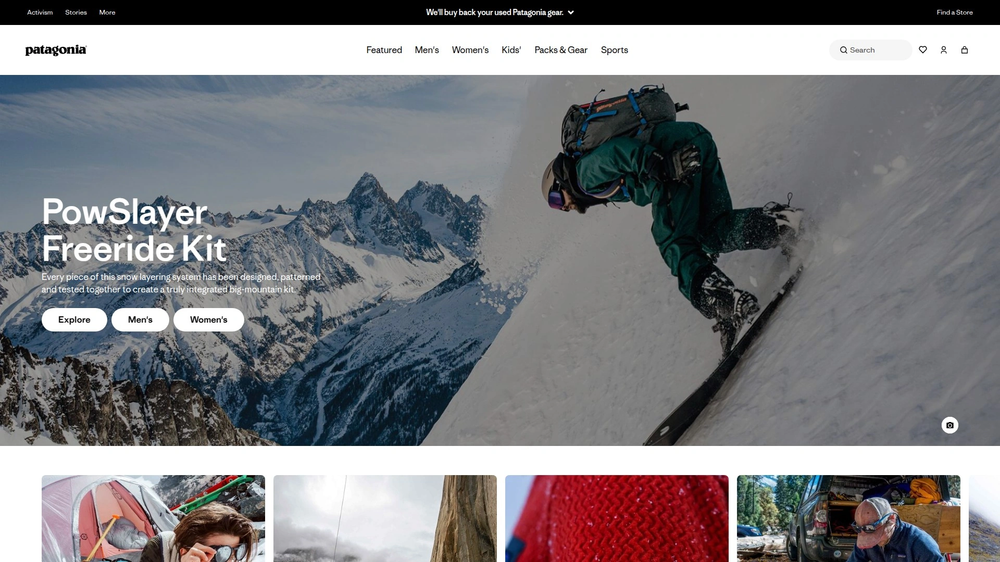

Founded by rock climber Yvon Chouinard, Patagonia combines technical outdoor performance with environmental stewardship that influences the entire outdoor industry. The company designs clothing and gear for climbing, skiing, surfing, fly fishing, trail running, and mountain biking using recycled materials and organic fabrics wherever technically feasible. Worn Wear program buys back used Patagonia items, repairs them, and resells at reduced prices extending product lifecycles while reducing manufacturing impacts. The company donates 1% of sales to environmental causes totaling over $140 million since 1985. Fair Trade Certified factories ensure ethical manufacturing conditions. Ironclad Guarantee covers repairs and replacements for products failing to meet performance expectations regardless of purchase date. Direct-to-consumer online sales eliminate retail markups while maintaining product quality standards. Physical stores in select cities provide hands-on shopping experiences and repair services. Activism campaigns protect public lands, combat climate change, and preserve wild spaces for future generations. The 2022 ownership transfer placing the company into a trust dedicated to fighting climate change represented unprecedented corporate environmentalism. Patagonia gear commands premium pricing reflecting quality materials, ethical manufacturing, and brand values resonating with conscious consumers.

***

## **[Evo](https://www.evo.com)**

Seattle-based retailer specializing in snow sports, mountain biking, and skateboarding with extensive buyer's guides and educational content.

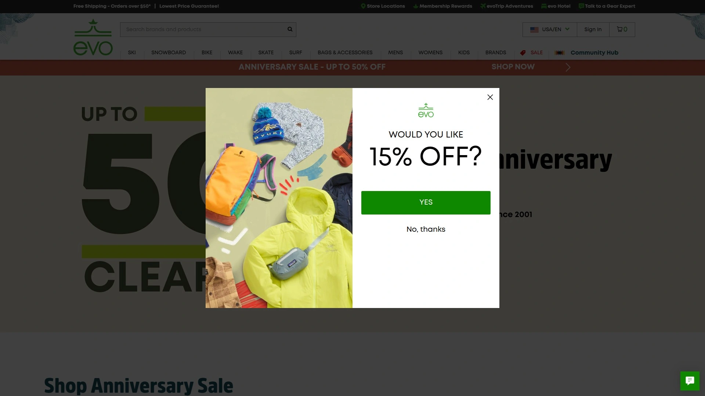

Founded in 2001 by former Microsoft employees, Evo operates physical stores in Seattle, Portland, Denver, and Whistler alongside comprehensive e-commerce. The platform emphasizes action sports including skiing, snowboarding, wakeboarding, mountain biking, and skating with deep product selection from specialized brands. Educational content through detailed buying guides helps customers understand technical specifications, sizing nuances, and product applications. The 366-day return policy provides full calendar year plus one day to evaluate purchases through complete seasons. Expert customer service from passionate enthusiasts provides knowledgeable guidance beyond generic product descriptions. Evo carries premium brands often unavailable through general sporting goods retailers. The site design prioritizes visual browsing with high-quality product photography and videos. Free shipping policies accommodate multi-item orders. Seasonal sales align with transition periods offering deep discounts on outgoing models. The company culture celebrates outdoor lifestyle through employee adventure programs and community events. Warehouse sales at physical locations move overstock at extreme discounts. Rental programs enable trying expensive equipment before purchasing.

***

## **[Moosejaw/Public Lands](https://www.publiclands.com)**

Michigan-founded outdoor retailer known for irreverent brand personality and comprehensive gear selection, now operating under the Public Lands banner.

Moosejaw built loyal following through quirky marketing combining quality outdoor gear with humor differentiating it from sterile outdoor retail competitors. Founded in 1992, the company carried 600+ brands including Marmot, Fjallraven, and Prana across categories spanning climbing, hiking, camping, snow sports, yoga, and water sports. Walmart acquired Moosejaw in 2017, expanding distribution while maintaining brand identity. Gear Wizards provided expert consultations helping customers select appropriate equipment. The gear rental program launched in 2022 enabled trying equipment before purchasing with free shipping both directions for rentals exceeding $49. In August 2024, Moosejaw abruptly closed remaining stores and shut down its website, redirecting customers to Public Lands, another Dick's Sporting Goods subsidiary launched in 2021. Public Lands continues serving outdoor enthusiasts with similar inventory spanning camping equipment, hiking gear, and outdoor apparel. The transition left longtime Moosejaw customers adjusting to new platforms while seeking familiar product selection and service quality. Physical locations in select markets provide hands-on shopping experiences.

***

## **[Arc'teryx](https://arcteryx.com)**

Canadian manufacturer of premium technical outerwear and equipment engineered for extreme alpine conditions with meticulous attention to detail.

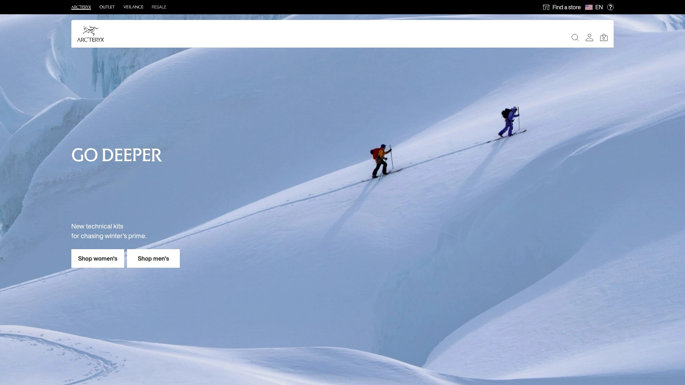

Founded in North Vancouver in 1989 by rock climbers, Arc'teryx represents the pinnacle of technical outdoor gear through obsessive design refinement and advanced materials. The company specializes in waterproof shells, insulated jackets, climbing harnesses, backpacks, and footwear engineered for demanding alpine environments. Gore-Tex Pro fabrics provide industry-leading weather protection while maintaining breathability during high-output activities. Articulated patterning and minimal seam construction enhance mobility and reduce weight. The bird logo signals premium pricing reflecting extensive R&D, material costs, and Canadian manufacturing for select product lines. Design centres in Vancouver and Munich focus on continuous product improvement through athlete feedback and field testing. The brand resonates with serious mountaineers, backcountry skiers, and climbers who depend on gear performance in life-threatening conditions. Retail stores called Brand Stores provide immersive shopping experiences with knowledgeable staff. Product repairs and warranty service maintain gear longevity. The company balances performance innovation with growing environmental consciousness through recycled materials and sustainable manufacturing practices. Lifetime warranty covers manufacturing defects though not normal wear from hard use.

***

## **[Sierra Trading Post/Sierra](https://www.sierra.com)**

Discount outdoor retailer offering brand-name equipment and apparel at 35-70% below retail prices through closeouts and overstock purchasing.

Sierra Trading Post, now simply Sierra, has delivered discounted outdoor gear since 1986 by purchasing manufacturer closeouts, overstocks, and prior season models. The platform carries hiking boots, camping equipment, ski gear, outdoor apparel, and accessories from recognized brands at significantly reduced prices. Email subscribers receive frequent coupon codes providing additional 15-40% discounts stacking on already-reduced prices. Selection varies based on available inventory with sizes and colors often limited. The treasure hunt shopping experience rewards flexibility and frequent browsing. Free shipping thresholds make bulk purchases economical. The company joined TJX Companies portfolio alongside TJ Maxx, Marshalls, and HomeGoods, expanding purchasing power and distribution. Physical stores in select markets enable hands-on inspection of discounted gear. The 60-day return policy provides reasonable evaluation windows. Sierra suits budget-conscious outdoor enthusiasts prioritizing value over having newest models. Serious bargains emerge during promotional periods when additional coupons apply to already-discounted merchandise. The platform requires monitoring since desirable items sell quickly at steep discounts.

***

## **[CampSaver](https://www.campsaver.com)**

Camping-focused online retailer emphasizing value pricing on 20,000+ products from 1,000+ brands with frequent promotional deals.

CampSaver launched in 1999 targeting camping and hiking enthusiasts seeking quality equipment at competitive prices. The platform carries 36,000+ product models spanning 3,000+ backpack options, 1,300+ tents and shelters, 800+ sleeping bags, and 3,000+ camp kitchen items including cookware, stoves, water bottles, and coolers. Climbing gear, outdoor apparel, footwear, and accessories round out comprehensive inventory. The prominent DEALS tab displayed in bright orange reflects core value proposition, listing seasonal promotions, coupon codes, and free gifts. Product banners highlight available discounts, outlet pricing, or included free shipping creating deal-focused browsing experience. Free 2-day shipping on qualifying orders expedites delivery. The 60-day return window accommodates gear testing. Customer service operates via chat and phone. Product information remains basic compared to specialty retailers focusing more on pricing than detailed specifications. The straightforward approach appeals to practical shoppers prioritizing savings over shopping experience polish. The site design feels functional rather than inspiring though navigation remains clear. Frequent promotional emails keep subscribers informed of latest deals.

***

## **[Steep and Cheap](https://www.steepandcheap.com)**

Flash deal outdoor retailer owned by Backcountry.com offering limited-time discounts on premium brands at 40-70% off retail prices.

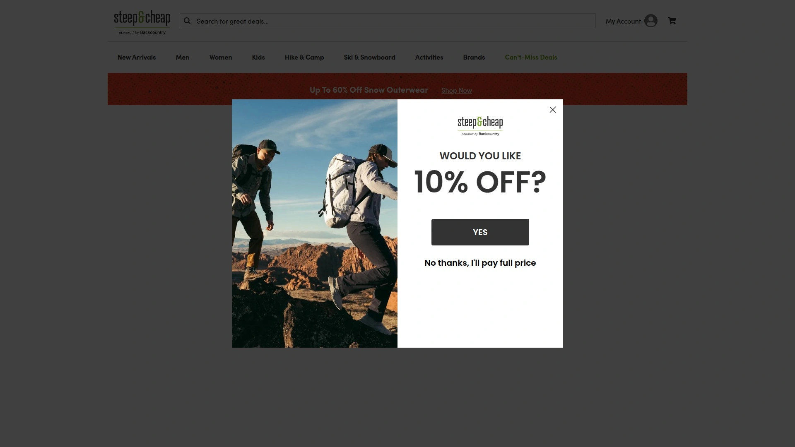

Steep and Cheap operates as Backcountry.com's discount outlet featuring daily deals on outdoor equipment and apparel. The platform pioneered flash deal format for outdoor gear where single products appeared at steep discounts for limited timeframes creating urgency. Evolution brought permanent inventory with ongoing sales across multiple products simultaneously. Shoppers find climbing gear, ski equipment, hiking boots, camping supplies, and outdoor clothing from recognized brands at significant discounts. Limited quantities and sizes require quick decisions when desirable products appear. The treasure hunt shopping experience rewards frequent browsing and flexibility regarding specific models and colors. Free shipping policies make single-item purchases practical. Selection changes frequently as inventory moves through Backcountry's distribution channels. Steep and Cheap suits bargain hunters willing to browse regularly and act decisively when appropriate gear appears at compelling prices. The 90-day return policy matches Backcountry's standard providing evaluation security. Customer service operates through Backcountry's infrastructure. The platform fills gaps for budget-conscious outdoor enthusiasts seeking premium gear at accessible price points.

***

## **[Mountain Warehouse](https://www.mountainwarehouse.com/us/)**

UK-based outdoor retailer offering affordable house-brand clothing and equipment through 200+ worldwide stores and e-commerce platform.

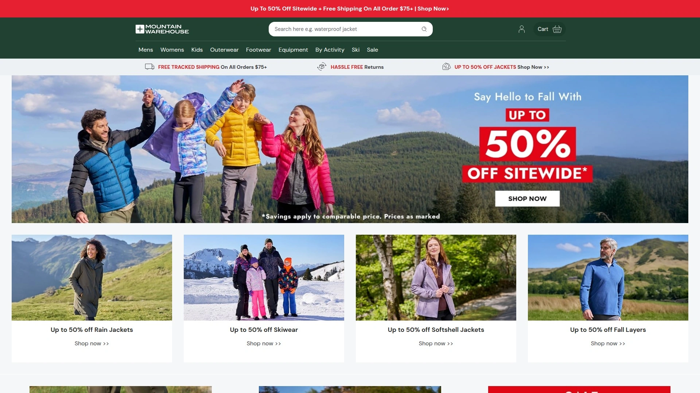

Founded in 1997, Mountain Warehouse controls manufacturing and distribution enabling competitive pricing on outdoor clothing and gear. The company operates over 200 physical stores globally providing hands-on shopping experiences. Most products carry exclusive Mountain Warehouse branding eliminating retail markups. Product categories span ski wear, hiking gear, camping equipment, outdoor apparel, and footwear sized for entire families. The affordability focus makes outdoor activities accessible to price-sensitive customers. Quality sits below premium brands though functionality suits casual outdoor recreation. Physical stores concentrate in the UK though expanding American presence increases accessibility. Online shopping complements retail locations with home delivery options. The value proposition appeals to families outfitting multiple members for seasonal activities without premium budget requirements. Expert advice from store staff guides product selection. Seasonal clearances offer additional savings on remaining inventory. International shipping reaches customers beyond physical store locations. The company positions itself as democratic outdoor outfitter removing financial barriers to getting outside.

***

## **[Decathlon](https://www.decathlon.com)**

French sporting goods retailer manufacturing affordable house-brand equipment across 80+ sports with innovative design and accessible pricing.

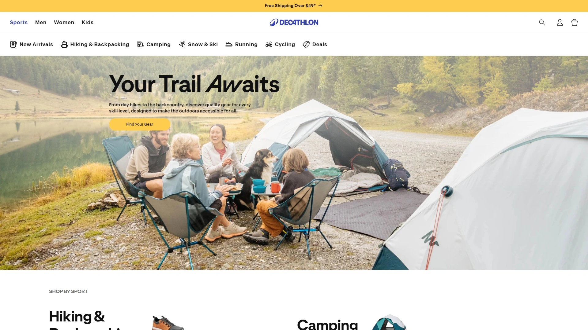

Decathlon operates as the world's largest sporting goods retailer with over 1,600 stores globally and comprehensive online platform. The company designs and manufactures house-brand equipment for 80+ sports including hiking, camping, skiing, climbing, cycling, and water sports. Vertical integration from design through manufacturing enables exceptional value pricing significantly below comparable branded equipment. Innovation focus brings technical features to accessible price points democratizing outdoor recreation. Each sport category operates under dedicated brand identity like Quechua for hiking and camping, Wedze for skiing, or Simond for climbing. Physical stores feature extensive layouts enabling hands-on product testing including cycling tracks, climbing walls, and camping display areas. Expert staff called "passionates" provide sport-specific guidance. The sustainability commitment emphasizes product repairability and recycling programs. American expansion brings European outdoor retail philosophy to US market. Lifetime warranty covers manufacturing defects. Decathlon suits budget-conscious beginners and families requiring comprehensive sporting equipment without premium pricing. Online shopping provides convenient access to full inventory with home delivery or store pickup options.

***

## **[Eastern Mountain Sports/EMS](https://www.ems.com)**

New England outdoor retailer with 70+ year heritage providing equipment and apparel alongside climbing walls and outdoor education programs.

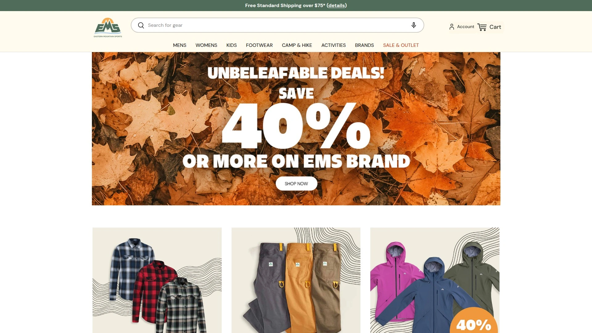

EMS launched in 1967 as outdoor education organization before expanding into retail. Physical stores throughout the Northeast United States provide regional presence with expert staff knowledgeable about local conditions and trails. The company carries major outdoor brands alongside proprietary EMS-branded equipment. Indoor climbing walls at select locations encourage community building and skill development. Outdoor education programs teach wilderness skills through classes and guided trips. Camping equipment, hiking gear, backpacking supplies, and outdoor apparel fill comprehensive inventory. Free shipping thresholds make online orders practical. The 60-day return policy provides evaluation security. EMS suits Northeast outdoor enthusiasts seeking regional expertise and community connection alongside quality gear. School programs introduce youth to outdoor activities through educational partnerships. The brand embodies New England outdoor culture and regional trail knowledge. Seasonal sales align with activity transitions offering previous season closeouts. The loyalty program rewards frequent shoppers. Physical store network enables convenient returns and exchanges. Online platform extends reach beyond store locations.

***

## **[Mountain Equipment Co-op/MEC](https://www.mec.ca)**

Canadian outdoor cooperative similar to REI providing equipment and apparel to members while supporting conservation and outdoor access.

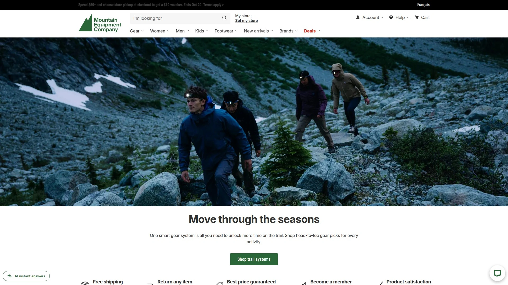

MEC operates as Canada's premier outdoor cooperative serving members across the country through retail stores and e-commerce. Founded in 1971, the co-op requires $5 lifetime membership providing access to exclusive sales and governance voting rights. Product selection spans camping equipment, climbing gear, hiking apparel, cycling components, and paddling supplies from major brands plus house-branded MEC gear. Gear rental programs enable trying equipment before purchasing or accessing specialized items for single trips. The gear swap platform facilitates member-to-member used equipment sales extending product lifecycles. Physical stores feature comprehensive layouts with expert staff. Sustainability initiatives emphasize environmental stewardship and ethical manufacturing. Community programs support outdoor access, trail building, and youth outdoor education. The co-op model aligns financial success with member value rather than shareholder profits. International shipping reaches customers beyond Canadian borders though selection may vary. The organization supports Indigenous outdoor traditions and land acknowledgment practices. MEC embodies Canadian outdoor culture and environmental values. Members influence company direction through democratic governance structures.

***

## **[Outdoor Gear Exchange/GearX](https://www.gearx.com)**

Vermont-based outdoor retailer specializing in new and used equipment with extensive ski and climbing gear selection.

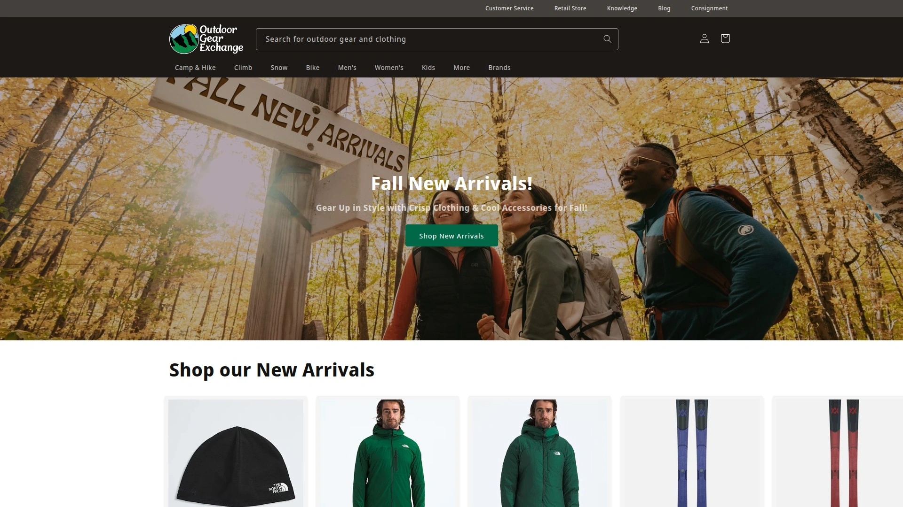

Founded in Burlington, Vermont, Gear X serves outdoor enthusiasts through physical retail location and online platform. The store carries new equipment from major brands alongside extensive used gear inventory. Ski tuning and repair services maintain winter sports equipment. Climbing gear selection reflects strong community connections with local climbers. Trade-in programs enable upgrading equipment while recovering value from outgrown or unnecessary gear. The consignment model facilitates buying and selling quality used equipment at fair prices. Physical location provides hands-on inspection of used gear crucial for safety-critical equipment. Staff expertise guides appropriate equipment selection based on skill levels and intended uses. New England trail knowledge informs recommendations for local conditions. The company emphasizes sustainability through used equipment promotion reducing manufacturing impacts. Seasonal inventory shifts reflect activity transitions from skiing to hiking and climbing. Online shopping extends reach beyond physical location though used equipment requires in-store transactions ensuring quality inspection. Community bulletin boards connect outdoor enthusiasts with partners, beta, and events. Burlington location positions store at the heart of Vermont outdoor recreation community.

***

## **[Competitive Cyclist](https://www.competitivecyclist.com)**

Specialized cycling retailer offering road bikes, mountain bikes, gravel setups, and components with expert guidance and competitive pricing.

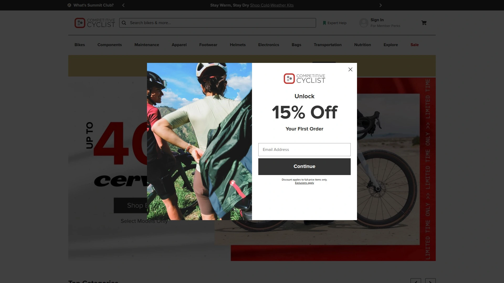

Competitive Cyclist focuses exclusively on cycling serving road riders, mountain bikers, and gravel enthusiasts with deep product expertise. The platform carries complete bikes from premium manufacturers plus extensive component selection enabling custom builds and upgrades. Expert Gearheads provide personalized consultations helping cyclists optimize equipment choices based on riding styles, fitness levels, and performance goals. Detailed product specifications and comparison tools assist technical purchasing decisions. Price match guarantee ensures competitive pricing on premium equipment. Free shipping and professional bike assembly add value to online purchases. The 30-day return policy accommodates fit and performance evaluation. Competitive Cyclist earned recognition as official US retailer for Tour de France products for three consecutive years through 2024, offering authentic jerseys, bibs, helmets, and collectibles. Road and mountain bike categories receive equal attention reflecting comprehensive cycling expertise. The platform suits serious cyclists requiring specialized knowledge beyond general sporting goods retailers. Seasonal sales offer premium components at reduced prices. Email notifications alert subscribers to deals on specific product categories.

***

## **[Fjallraven](https://www.fjallraven.com)**

Swedish outdoor brand manufacturing functional apparel and equipment with distinctive designs prioritizing durability over fashion trends.

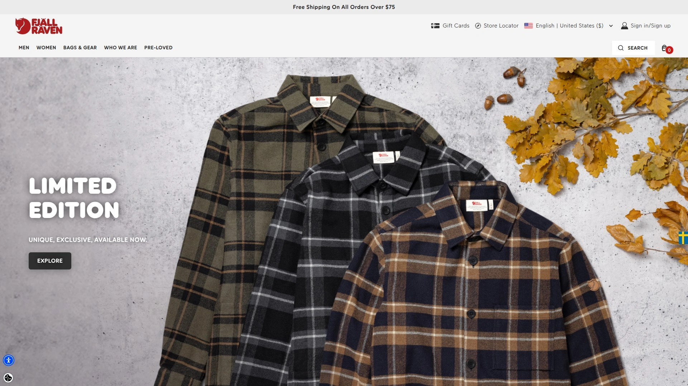

Founded in 1960, Fjallraven creates timeless outdoor gear emphasizing longevity and repairability over disposable fashion. The iconic Kanken backpack became global phenomenon transcending outdoor niche into urban lifestyle. Technical apparel uses proprietary G-1000 fabric combining cotton and polyester providing weather resistance, durability, and environmental wax treatment for additional protection. Product design prioritizes function with thoughtful details like reinforced wear areas and practical pocket placement. Swedish heritage influences design philosophy emphasizing quality, simplicity, and environmental respect. The company operates dedicated brand stores alongside wholesale distribution through outdoor retailers. Sustainability initiatives include recycled materials, responsible down sourcing, and product repair services extending gear lifecycles. Fjallraven Classic trekking events in multiple countries build community among brand enthusiasts. Online shopping provides access to full product line with detailed descriptions and sizing information. Lifetime warranty covers manufacturing defects demonstrating confidence in product quality. Premium pricing reflects Scandinavian manufacturing costs and design quality. The brand resonates with outdoor enthusiasts valuing durability and understated aesthetics over flashy branding.

***

## **[Campmor](https://www.campmor.com)**

New Jersey outdoor retailer since 1978 offering comprehensive camping and hiking equipment with catalog and e-commerce platforms.

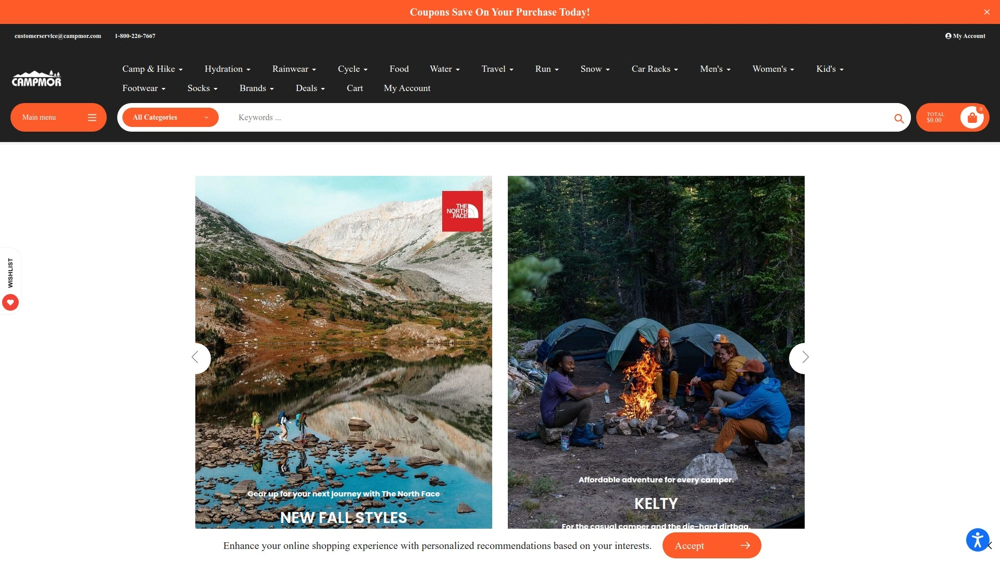

Campmor serves outdoor enthusiasts through catalog and online channels carrying camping gear, hiking equipment, outdoor apparel, and accessories. The company ships from New Jersey warehouse providing East Coast customers with quick delivery. Product selection emphasizes camping and hiking though expanding into climbing, paddling, and winter sports. Competitive pricing balances value with quality equipment. Frequent sales and clearance sections offer discounted merchandise. Physical outlet store location enables hands-on inspection of closeout items. Customer service operates via phone assisting with product selection and order questions. The traditional catalog business evolved into comprehensive e-commerce maintaining personalized service approach. Family-owned operation emphasizes customer relationships over corporate growth metrics. Product descriptions provide technical specifications and application guidance. Free shipping thresholds make multi-item orders economical. The straightforward shopping experience lacks modern flourishes focusing on functional product presentation. Campmor suits practical outdoor enthusiasts seeking reliable equipment without premium positioning. Newsletter subscribers receive promotional notifications and exclusive discounts. Return policies provide reasonable evaluation windows.

***

## **[Outdoor Gear Lab](https://www.outdoorgearlab.com)**

Independent gear testing organization providing comprehensive product reviews based on side-by-side field testing rather than retail sales.

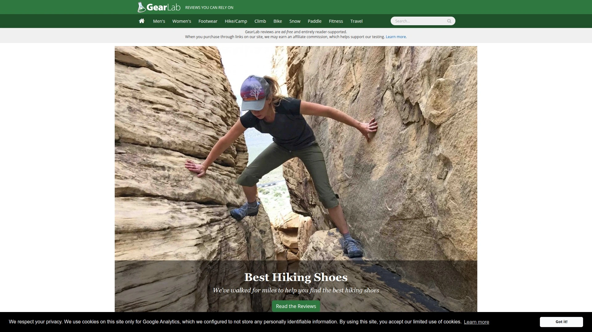

Outdoor Gear Lab operates as trusted information source rather than retailer, conducting rigorous gear testing across hiking, camping, climbing, skiing, cycling, and fitness categories. Expert testers evaluate products through months of field use measuring objective performance metrics and subjective user experience factors. Side-by-side comparison methodology enables ranking products within categories identifying clear winners and value options. Detailed reviews explain testing procedures, scoring methodology, and specific performance characteristics guiding informed purchasing decisions. Photography and video documentation illustrates gear performance in actual use conditions. Buyer's guides synthesize testing results with practical advice for matching gear to specific needs and budgets. The organization monetizes through retailer connections rather than direct sales maintaining editorial independence. Testing investments totaling thousands of dollars per product category demonstrate commitment to thorough evaluation. Updated reviews track product evolution and new model releases. Outdoor Gear Lab competes with traditional outdoor media through transparent testing focused on practical guidance over advertising relationships. The resource proves invaluable when researching significant gear purchases.

***

## **[Garage Grown Gear](https://www.garagegrowngear.com)**

Curated platform showcasing innovative cottage industry outdoor brands producing specialized ultralight and custom equipment.

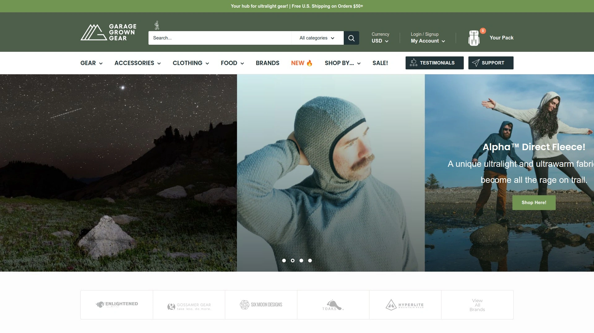

Garage Grown Gear champions small outdoor manufacturers creating specialized equipment outside traditional mass production. The platform connects customers with cottage industry brands producing ultralight backpacking gear, custom climbing equipment, handmade shelters, and innovative accessories. Product selection emphasizes functionality and craftsmanship over marketing budgets and brand recognition. Many featured brands operate as one-person operations or small teams maintaining direct customer relationships. Ultralight backpacking focus reflects strong community connections though expanding into climbing, camping, and cycling. The curated approach ensures quality standards and brand authenticity protecting customers from unvetted manufacturers. Detailed product descriptions explain unique features and applications since cottage gear often serves specific niches. Garage Grown Gear suits experienced outdoor enthusiasts seeking performance advantages through specialized equipment unavailable at mainstream retailers. Lead times may extend weeks or months as small manufacturers fulfill orders individually. Customer service connects directly with brand creators enabling detailed product discussions. The platform builds community around innovation and craftsmanship celebrating outdoor gear entrepreneurship.

***

## **[Black Diamond](https://www.blackdiamondequipment.com)**

Climbing and skiing equipment manufacturer operating since 1989 producing technical gear for mountain sports worldwide.

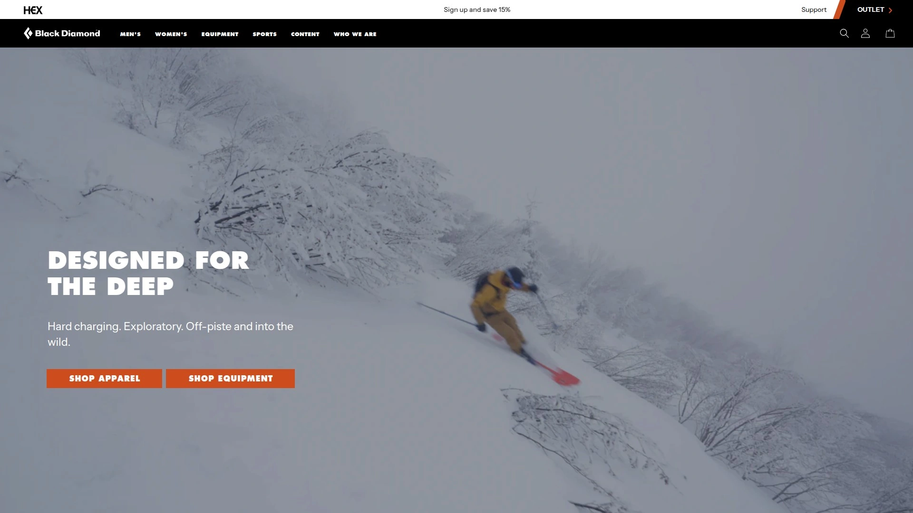

Black Diamond designs and manufactures climbing, skiing, and mountain sports equipment trusted by professional athletes and weekend warriors. Product lines include climbing hardware, ropes, harnesses, helmets, backpacks, trekking poles, avalanche safety equipment, headlamps, and technical apparel. The company emphasizes innovation through extensive testing and athlete feedback. Utah headquarters maintains engineering and development proximity to world-class climbing and skiing testing grounds. International distribution reaches climbing gyms, ski shops, and outdoor retailers globally. Direct-to-consumer online sales enable comprehensive product selection beyond retail floor limitations. Detailed product information assists technical purchasing decisions. Black Diamond Academy provides educational content teaching proper equipment use and mountain safety. Warranty and repair services maintain equipment through hard use. The brand resonates with serious climbers and skiers requiring gear performance in demanding conditions. Safety testing and quality control prevent equipment failures in life-threatening situations. Environmental initiatives include recycled materials and sustainable manufacturing. Product development partnerships with professional athletes drive innovation benefiting entire customer base.

***

## **[The North Face](https://www.thenorthface.com)**

Heritage outdoor brand manufacturing technical apparel and equipment while maintaining strong retail presence through brand stores worldwide.

Founded in 1966 in San Francisco, The North Face evolved from specialty mountaineering shop into global outdoor lifestyle brand. Product categories span technical outerwear, insulated jackets, hiking boots, backpacks, tents, sleeping bags, and casual outdoor-inspired apparel. Professional athlete partnerships drive technical innovation in expedition-grade equipment. VF Corporation ownership since 2000 provided resources for global expansion while maintaining brand identity. Direct-to-consumer sales through brand stores and online platform control customer experience. Widespread wholesale distribution through outdoor retailers and department stores increases accessibility. The brand balances technical performance with urban styling creating crossover appeal beyond hardcore outdoor enthusiasts. Sustainability initiatives include recycled materials and circular economy programs. Lifetime warranty covers manufacturing defects. The iconic logo signals quality and heritage though ubiquity diminishes exclusivity some outdoor purists prefer. Product lines range from entry-level recreational equipment to expedition-grade technical gear. Seasonal sales offer accessible pricing on popular items. Physical stores provide hands-on shopping and personalized fitting services.

***

## **[Columbia Sportswear](https://www.columbia.com)**

Portland-based outdoor brand offering accessible pricing on functional apparel and footwear for casual outdoor recreation.

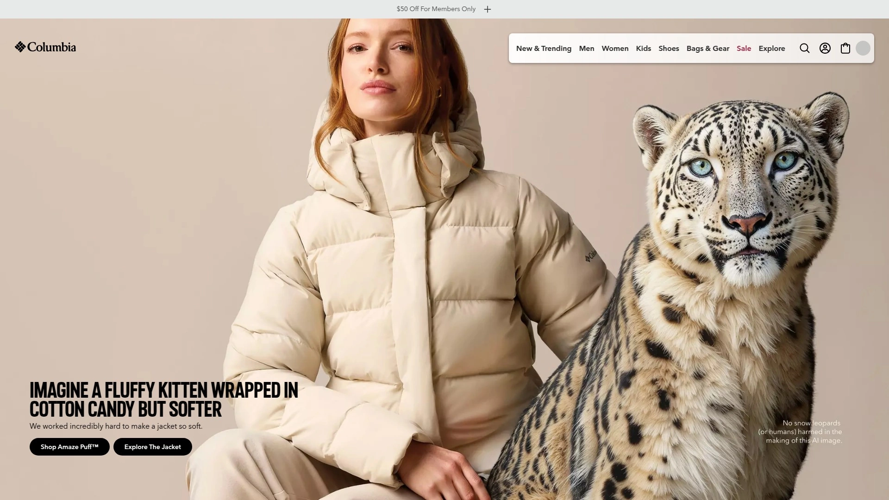

Columbia Sportswear serves mainstream outdoor market with practical equipment and apparel at accessible price points. Founded in 1938, the company grew from small hat distributor into global outdoor brand. Proprietary technologies like Omni-Heat thermal reflective lining and Omni-Tech waterproofing provide functional performance at competitive prices. Product categories span jackets, fleece, hiking boots, casual outdoor apparel, and accessories. Wide distribution through outdoor retailers, department stores, and brand outlets increases availability. The brand positioning targets practical outdoor recreation over extreme mountain sports. Family sizing accommodates complete household outfitting. Frequent sales and outlet stores offer additional value. Direct-to-consumer online sales provide full product selection. Physical outlet stores move closeout inventory at steep discounts. Columbia suits casual hikers, campers, and outdoor enthusiasts seeking functional gear without premium positioning. The brand balances technical features with mainstream styling creating versatile clothing transitioning between trail and town. Greater Outdoors loyalty program rewards frequent shoppers. Seasonal collections introduce updated styles while maintaining core product lines.

***

## **[Helly Hansen](https://www.hellyhansen.com)**

Norwegian technical apparel manufacturer specializing in waterproof and insulated clothing for sailing, skiing, and outdoor work since 1877.

Helly Hansen brings 140+ years of expertise creating weather protection for demanding maritime and mountain environments. The company pioneered waterproof fabrics and insulated clothing protecting workers and adventurers in extreme conditions. Core categories include sailing apparel, ski clothing, workwear, and lifestyle outdoor garments. Professional partnerships with national ski teams and sailing crews inform product development. Norwegian heritage influences design philosophy emphasizing reliable protection in harsh weather. Proprietary fabrics like Helly Tech waterproofing provide proven performance. The brand resonates with serious sailors, ski professionals, and outdoor workers depending on gear in life-threatening conditions. Direct-to-consumer online sales showcase complete product lines. Retail partnerships provide physical shopping experiences. Premium pricing reflects technical development and proven performance records. Product testing in Norwegian conditions ensures reliability in severe weather. Sustainability initiatives address environmental impacts while maintaining performance standards. Lifetime warranties cover manufacturing defects. The brand maintains technical credibility while expanding into casual outdoor lifestyle markets.

***

## **[Salomon](https://www.salomon.com)**

French mountain sports brand engineering footwear, skis, and equipment for running, hiking, and winter sports with racing heritage.

Salomon began producing ski bindings in the French Alps in 1947 before expanding into complete winter sports equipment. The company revolutionized trail running through technical footwear development creating entire product category. Current offerings span trail running shoes, hiking boots, alpine and backcountry ski equipment, snowboards, outdoor apparel, and backpacks. Racing partnerships influence technical innovations benefiting recreational athletes. The brand emphasizes performance over casual outdoor styling. Proprietary technologies like Contagrip rubber outsoles and Advanced Chassis systems provide proven advantages. Online shopping offers complete product selection with detailed technical specifications. Retail distribution through outdoor and ski shops provides hands-on product evaluation. Salomon suits serious runners, hikers, and skiers requiring performance-oriented equipment. Product design reflects mountain sports heritage with functional aesthetics. Seasonal collections introduce updated technologies while maintaining proven platforms. Pro team partnerships with ultra-runners and ski mountaineers drive development. Sustainability initiatives include recycled materials and reduced environmental impacts. Warranty services maintain equipment through hard use.

***

## **[Marmot](https://www.marmot.com)**

Technical outdoor brand specializing in high-performance outerwear, sleeping bags, and tents engineered for extreme conditions since 1974.

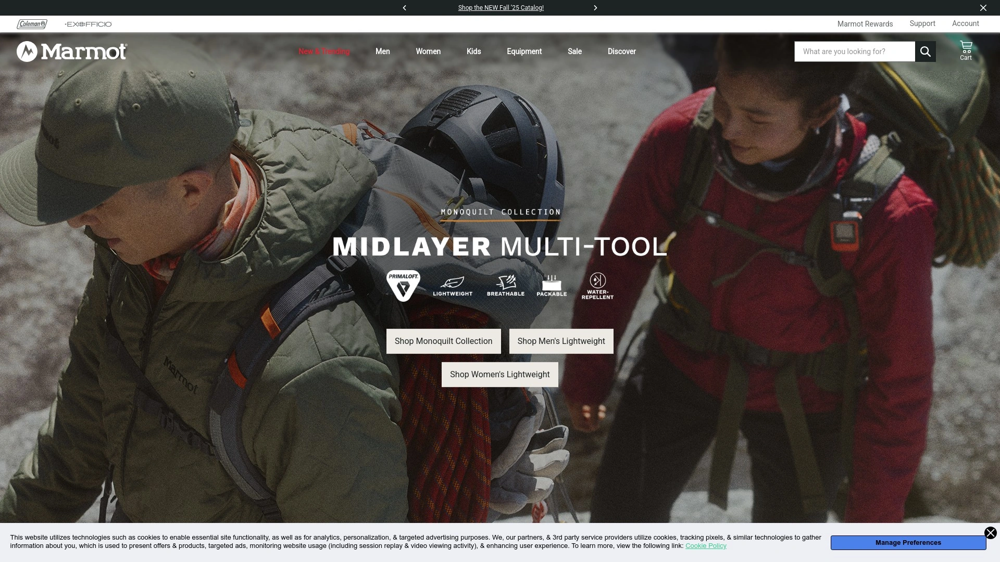

Founded by University of California students testing equipment in Alaska, Marmot built reputation through technical innovation in mountain gear. Product lines emphasize advanced materials and construction in sleeping bags, tents, technical jackets, and outdoor apparel. Down insulation expertise produces warmth-to-weight ratios enabling lightweight expedition equipment. Gore-Tex partnerships deliver proven waterproof breathable protection. The brand targets serious backpackers, mountaineers, and climbers requiring reliable performance in harsh conditions. Lifetime warranty demonstrates confidence in product durability. Newell Brands ownership since 2004 provided resources while maintaining product integrity. Online direct sales showcase complete collections with technical specifications assisting purchasing decisions. Outdoor retail distribution provides physical product evaluation. Marmot suits equipment buyers prioritizing proven performance over trendy styling. Premium pricing reflects quality materials and construction. Sustainability initiatives include recycled down and environmentally conscious manufacturing. Product testing in mountain environments ensures reliability when conditions turn serious. The brand maintains technical credibility within climbing and mountaineering communities.

***

## **[Outdoor Research](https://www.outdoorresearch.com)**

Seattle-based outdoor equipment manufacturer known for innovative accessories, technical apparel, and problem-solving approach to gear design.

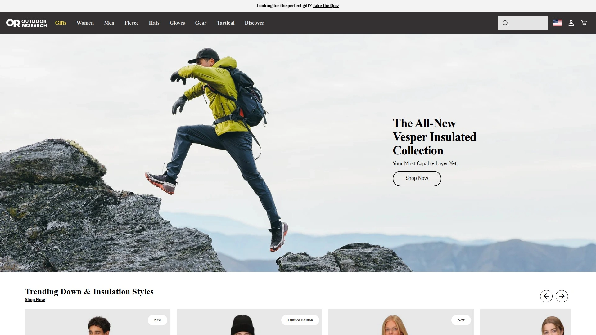

Founded in 1981 by mountaineer Ron Gregg solving equipment problems through innovative designs, Outdoor Research emphasizes functional solutions over marketing trends. Product development focuses on accessories like gloves, hats, gaiters, and hydration systems often overlooked by larger brands. Technical apparel lines provide complete outdoor clothing systems. Proprietary fabrics and construction methods deliver proven performance. The Infinite Guarantee covers product repairs and replacements demonstrating commitment to customer satisfaction. Seattle headquarters maintains proximity to Cascade mountain testing grounds. Professional athlete partnerships provide real-world feedback driving continuous improvement. The brand resonates with practical outdoor enthusiasts valuing function over fashion. Direct-to-consumer online sales offer complete product selection. Retail distribution through specialty outdoor shops provides physical evaluation. Outdoor Research suits climbers, skiers, and backpackers seeking reliable equipment from detail-oriented manufacturer. Innovation focus brings fresh solutions to established gear categories. Sustainability initiatives include recycled materials and responsible manufacturing. The company maintains independence resisting consolidation trends affecting outdoor industry.

***

## **[FAQ]**

**How do online outdoor retailers ensure gear authenticity and prevent counterfeit products?**

Legitimate outdoor retailers like Backcountry, REI, and Evo purchase inventory directly from manufacturers through authorized distribution channels, guaranteeing authentic products with valid warranties. These platforms avoid marketplace models allowing third-party sellers who might introduce counterfeit items, instead maintaining complete control over inventory sources and quality verification processes.

**What return policies should I expect from quality outdoor gear retailers?**

Top outdoor retailers typically offer 30-90 day return windows with REI's member policy extending to one year and Backcountry providing 90 days. These generous timeframes recognize that gear performance often can't be evaluated until field-tested on actual trips, allowing customers to return equipment that doesn't meet expectations after real-world use rather than just trying on items at home.

**Should I buy discounted previous season models or pay full price for latest gear?**

Previous season gear from outlets like Steep and Cheap or Sierra often delivers identical performance to current models at 40-70% discounts, with changes limited to colorways or minor updates rather than fundamental improvements. However, cutting-edge innovations in materials science and design occasionally justify premium pricing for latest models when seeking maximum performance advantages in technical categories like waterproof shells or insulated layers.

***

## **Conclusion**

The right outdoor gear retailer balances authentic product selection from trusted brands with knowledgeable customer service, return policies accommodating real-world testing, and pricing structures respecting your budget without sacrificing safety or performance. [Backcountry](https://www.backcountry.com) leads this category for comprehensive equipment selection spanning all mountain sports, expert Gearhead consultations providing personalized recommendations, and the 90-day return policy enabling thorough field evaluation before committing to expensive expedition equipment. Match your specific needs—technical alpine gear, budget camping equipment, or specialty cycling components—to the appropriate retailer and invest confidently in equipment that enhances rather than hinders your outdoor adventures.
